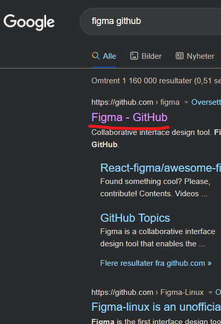
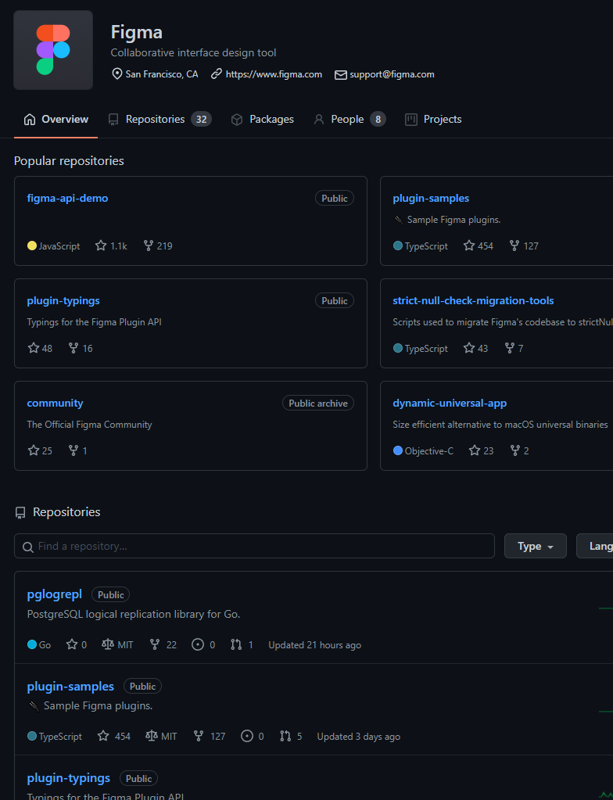
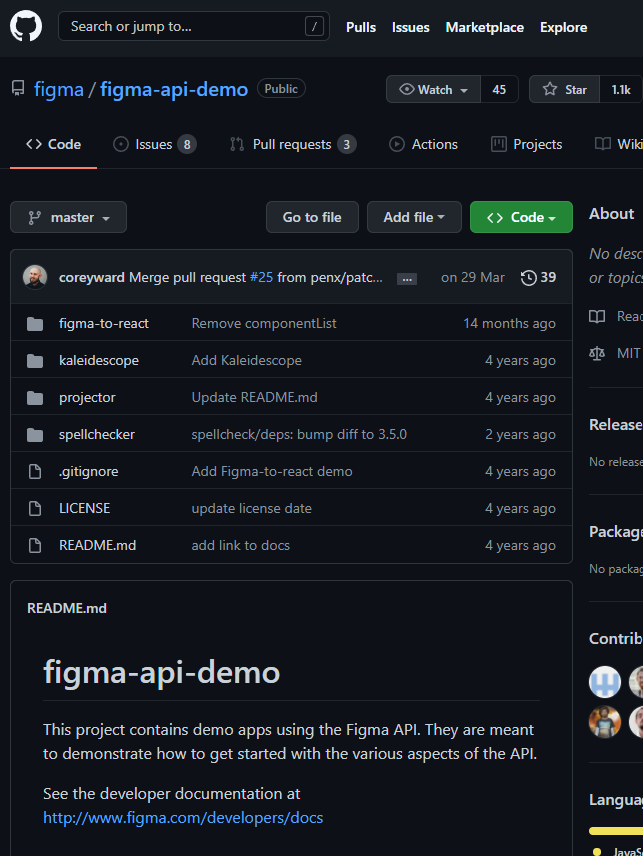
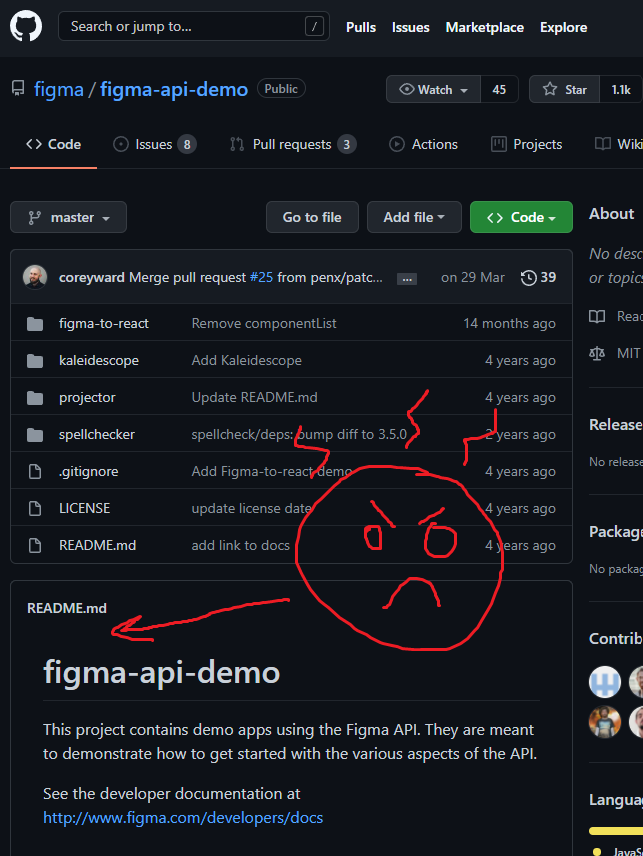
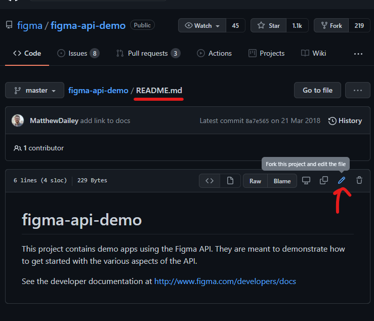
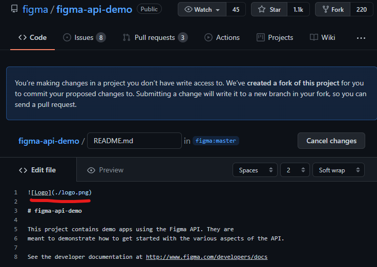
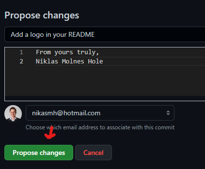
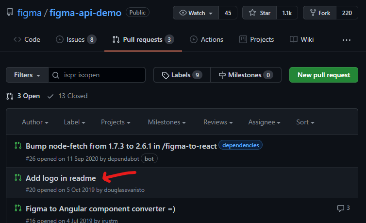

# Hacktoberfest intro 🎃

## Niklas M. Hole

### 14. Oktober 2021

---

# Hva er Hacktoberfest for no? 🤔

---

<!-- header: Hva er Hacktoberfest for no? 🤔 -->

Den er nesten som Oktoberfest, bare at:

- Man ikke bruker lederhosen eller dirndl.

---

<!-- header: Hva er Hacktoberfest for no? 🤔 -->

Den er nesten som Oktoberfest, bare at:

- Man ikke bruker lederhosen eller dirndl
- Man drikker halvlitere med øl, og ikke hele liter

---

<!-- header: Hva er Hacktoberfest for no? 🤔 -->

Den er nesten som Oktoberfest, bare at:

- Man ikke bruker lederhosen eller dirndl
- Man drikker halvlitere med øl, og ikke hele liter
- Det er egentlig alt

---

<!-- header: Hva er Hacktoberfest for no? 🤔 -->

# Det er en fest!

Men ikke la deg rive med helt enda

---

<!-- header: Hva er Hacktoberfest for no? 🤔 -->

# Det er en fest!

Men ikke la deg rive med helt enda

Det handler også om å hjelpe andre 🤗

---

<!-- header: Hva er Hacktoberfest for no? 🤔 -->

# Hjelpe med hva da?

Ja nå kan du lure! Nei da, la oss hoppe rett inn i selve essensen av Hacktoberfest:

- Arrangement av DigitalOcean 🌊
- 8-ende året 🎱
- Feire open-source 🎉 med å hjelpe til på open-source-prosjekter 🤗
- Kan gjøres alene eller sammen med andre 😄

---

<!-- header: '' -->

# Hvorfor vil vi fremme open-source?

---

<!-- header: 'Hvorfor vil vi fremme open-source?' -->

# Hvorfor vil vi fremme open-source?

Fordi:

- Da kan alle få være med å si noe på prosjektet! **#demokrati-ish**
- Koden kan kvalitetssjekkes av andre **#trygghet**
- Man kan lære av andres prosjekter **#læring**

---

<!-- header: '' -->

# Hvorfor skal akkurat _du_ bruke open-source?

---

<!-- header: 'Hvorfor skal akkurat *du* bruke open-source?' -->

# Hvorfor skal akkurat _du_ bruke open-source?

- Du får øvelse i å dele ideene dine med andre
- Du kan inspirere andre
- Mange gratis verktøy:
  - Hosting av nettside (Vercel, GitHub)
  - Bygging av nettside (Drone, CircleCI, Travis, Vercel, GitHub Actions)
- Enkelt å dele med andre
- Mulighet til å få hjelp av andre du ikke kjenner

---

<!-- header: '' -->

# "Men jeg er jo bare en vanlig person. Hvordan kan _jeg_ bidra?"

---

<!-- header: 'Hvordan bli en open-sourcerer på 1-2-3 🧙‍♂️' -->

# Hvordan bli en open-sourcerer på 1-2-3 🧙‍♂️

Hold fast i datamaskinen din!

---

1. Gå på Google, skriv **"<hva du vil bidra på> github"**

---

<!-- header: 'Hvordan bli en open-sourcerer på 1-2-3 🧙‍♂️' -->

1. Gå på Google, skriv **"<hva du vil bidra på> github"**
2. Trykk på første linken

---

<!-- header: 'Hvordan bli en open-sourcerer på 1-2-3 🧙‍♂️' -->

1. Gå på Google, skriv **"<hva du vil bidra på> github"**
2. Trykk på første linken
3. Finn hvor prosjektet ligger (antall stjerner ⭐ og forks 🍴 er ofte en god indikator)

---

<!-- header: 'Hvordan bli en open-sourcerer på 1-2-3 🧙‍♂️' -->

1. Gå på Google, skriv **"<hva du vil bidra på> github"**
2. Trykk på første linken
3. Finn hvor prosjektet ligger (antall stjerner ⭐ og forks 🍴 er ofte en god indikator)
4. HAR DE IKKE LOGO I README'EN!?

---

<!-- header: 'Hvordan bli en open-sourcerer på 1-2-3 🧙‍♂️' -->

1. Gå på Google, skriv **"<hva du vil bidra på> github"**
2. Trykk på første linken
3. Finn hvor prosjektet ligger (antall stjerner ⭐ og forks 🍴 er ofte en god indikator)
4. HAR DE IKKE LOGO I README'EN!??
5. Bli litt sinna, ha en liten rant i hodet ditt

---

<!-- header: 'Hvordan bli en open-sourcerer på 1-2-3 🧙‍♂️' -->

1. Gå på Google, skriv **"<hva du vil bidra på> github"**
2. Trykk på første linken
3. Finn hvor prosjektet ligger (antall stjerner ⭐ og forks 🍴 er ofte en god indikator)
4. HAR DE IKKE LOGO I README'EN!??
5. Bli litt sinna, ha en liten rant i hodet ditt
6. Naviger til filen og trykk på blyanten

---

<!-- header: 'Hvordan bli en open-sourcerer på 1-2-3 🧙‍♂️' -->

1. Gå på Google, skriv **"<hva du vil bidra på> github"**
2. Trykk på første linken
3. Finn hvor prosjektet ligger (antall stjerner ⭐ og forks 🍴 er ofte en god indikator)
4. HAR DE IKKE LOGO I README'EN!??
5. Bli litt sinna, ha en liten rant i hodet ditt
6. Naviger til filen og trykk på blyanten
7. Legg inn endringen din

---

<!-- header: 'Hvordan bli en open-sourcerer på 1-2-3 🧙‍♂️' -->

1. Gå på Google, skriv **"<hva du vil bidra på> github"**
2. Trykk på første linken
3. Finn hvor prosjektet ligger (antall stjerner ⭐ og forks 🍴 er ofte en god indikator)
4. HAR DE IKKE LOGO I README'EN!??
5. Bli litt sinna, ha en liten rant i hodet ditt
6. Naviger til filen og trykk på blyanten
7. Legg inn endringen din
8. Beskriv endringen og trykk på grønn knapp

---

<!-- header: 'Hvordan bli en open-sourcerer på 1-2-3 🧙‍♂️' -->

1. Gå på Google, skriv **"<hva du vil bidra på> github"**
2. Trykk på første linken
3. Finn hvor prosjektet ligger (antall stjerner ⭐ og forks 🍴 er ofte en god indikator)
4. HAR DE IKKE LOGO I README'EN!??
5. Bli litt sinna, ha en liten rant i hodet ditt
6. Naviger til filen og trykk på blyanten
7. Legg inn endringen din
8. Beskriv endringen og trykk på grønn knapp
9. Arrg!! Noen var raskere enn meg 😡

---

<!-- header: 'Hvordan bli en open-sourcerer på 1-2-3 🧙‍♂️' -->

## Men det går fint!

Det handler ikke om å være først. Det handler om å hjelpe til 🤗

Nå kan du ta en slurk til av pilsen din.

---

<!-- header: 'Hvordan bli en open-sourcerer på 1-2-3 🧙‍♂️' -->

# Husk å registrer deg på https://hacktoberfest.digitalocean.com

Får du godkjent\* 4 PR'er får du en t-skjorte med masse klistremerker! 🤩

Men vær kjapp; det er bare 50 000 stk 😬 (godt under 0.01% av jordas befolkning får dette)

Man må ikke ta i mot t-skjorte, man kan også velge å plante et tre 🌲🌍

Du kan finne mer informasjon på nettsiden deres.

\*godkjent betyr at PR'en din ikke blir rapportert på x-antall dager med "spam" eller "invalid" label.

---

<!-- header: '' -->
